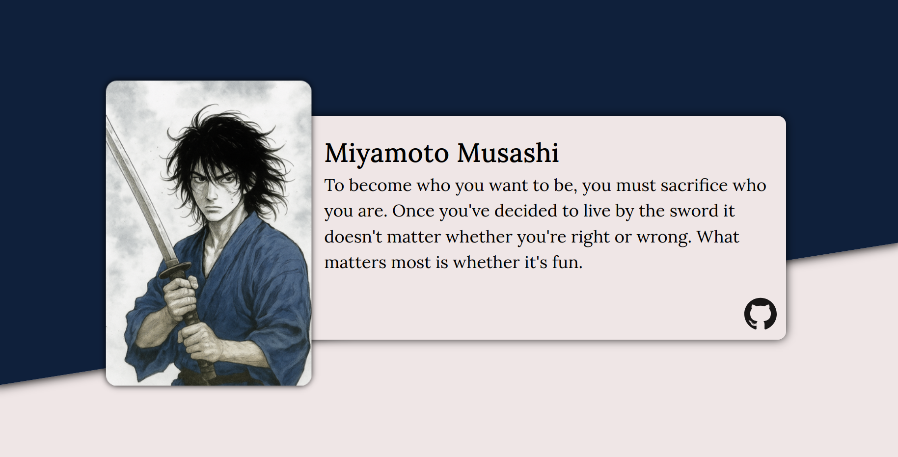

# Homepage

A responsive portfolio homepage built to showcase my projects and demonstrate advanced layout and adaptive design skills. The page dynamically displays project cards using JavaScript and GitHub API, bundled with Webpack for modularity and efficient asset management.

## Preview



**Live Demo:** [https://wrzdx.github.io/Homepage/](https://wrzdx.github.io/Homepage/)

## Features

* Responsive grid layout for project cards
* Dynamic project data fetched from GitHub API
* Adaptive design for desktop, tablet, and mobile devices
* Modular JavaScript with Webpack bundling
* Smooth animations and hover effects

## Key Skills Demonstrated

✅ Responsive HTML/CSS layouts
✅ CSS Grid and Flexbox techniques
✅ GitHub API integration
✅ JavaScript async/await and promises
✅ Webpack configuration and modular code structure

## How to Run

1. Clone the repository:

```bash
git clone https://github.com/wrzdx/Homepage.git
```

2. Install dependencies:

```bash
npm install
```

3. Start development server:

```bash
npm run dev
```

4. Open `http://localhost:8080` in your browser

For production build:

```bash
npm run build
```

---

*Part of The Odin Project's Full Stack JavaScript Curriculum*
*Focuses on responsive design, API integration, and modular JavaScript development*
